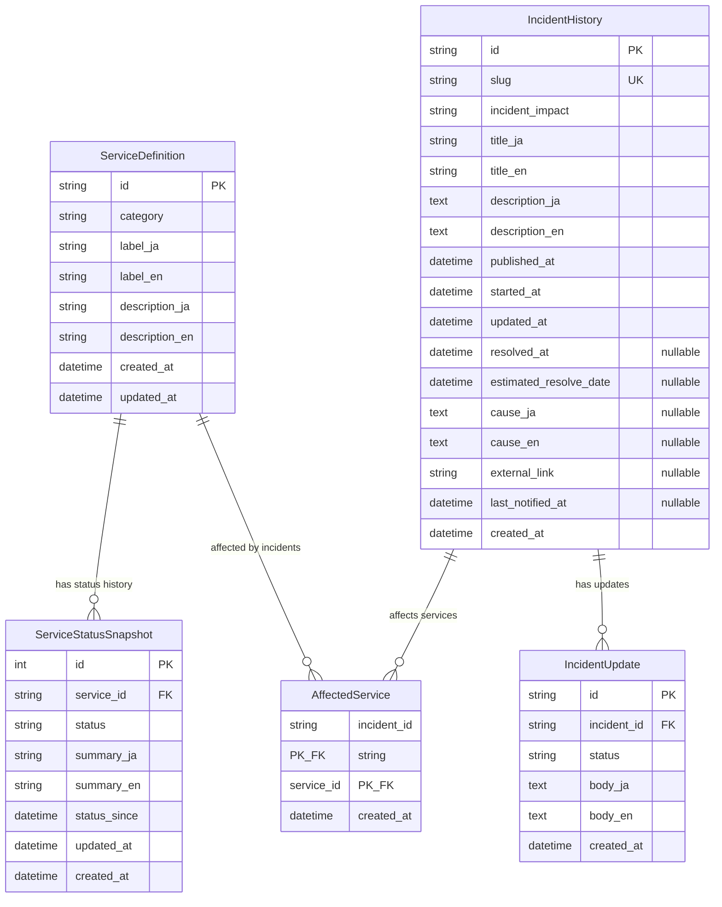

# Entity Relationship Diagram



## Table Relationships

### One-to-Many Relationships

1. **ServiceDefinition → ServiceStatusSnapshot**
   - A service can have multiple status snapshots (temporal history)
   - Foreign key: `ServiceStatusSnapshot.service_id` → `ServiceDefinition.id`
   - On delete: CASCADE

2. **IncidentHistory → IncidentUpdate**
   - An incident can have multiple updates (chronological timeline)
   - Foreign key: `IncidentUpdate.incident_id` → `IncidentHistory.id`
   - On delete: CASCADE

### Many-to-Many Relationship

3. **ServiceDefinition ↔ IncidentHistory** (via AffectedService)
   - An incident can affect multiple services
   - A service can be affected by multiple incidents
   - Junction table: `AffectedService`
   - Composite primary key: (`incident_id`, `service_id`)
   - On delete: CASCADE (both foreign keys)

## Indexes

### ServiceStatusSnapshot
- `service_id` - for efficient service status lookup

### IncidentHistory
- `slug` (unique) - for URL-friendly access
- `published_at` - for chronological sorting

### IncidentUpdate
- `incident_id` - for efficient incident update retrieval

### AffectedService
- `incident_id` - for finding all services affected by an incident
- `service_id` - for finding all incidents affecting a service

## Data Flow

```
ServiceDefinition (Service Catalog)
    ↓
    ├─→ ServiceStatusSnapshot (Current & Historical Status)
    └─→ AffectedService ←─┐
                          │
IncidentHistory (Incidents) ─┘
    ↓
    └─→ IncidentUpdate (Update Timeline)
```

## Key Design Decisions

1. **Bilingual Support**: All user-facing text fields have `_ja` and `_en` variants
2. **Temporal Data**: ServiceStatusSnapshot stores status history, not just current state
3. **Normalization**: Service definitions separated from their status to avoid duplication
4. **Flexible Relationships**: Many-to-many design allows one incident to affect multiple services
5. **Audit Trail**: All tables include timestamp fields for tracking changes
